<div align="center">

# 🗳️ Smart Voting System (Voting_SM)
### *Next-Gen Biometric-Secured Anti-Fraud E-Voting & Real-Time Analytics Platform*

[](https://reactjs.org/)
[](https://vitejs.dev/)
[](https://tailwindcss.com/)
[](https://nodejs.org/)
[](https://expressjs.com/)
[](https://opensource.org/licenses/MIT)
[](http://makeapullrequest.com)

<br/>

> **A high-security, tamper-resistant digital voting solution featuring real-time webcam facial biometrics, two-factor OTP authentication, cryptographic single-vote ledgers, and comprehensive coverage across all 234 Assembly Constituencies of Tamil Nadu.**

<br/>

[Key Features](#-key-features) • [Workflow & Security](#-security--biometric-workflow) • [Tech Stack](#-technology-stack) • [Quick Start](#-quick-start-guide) • [API Reference](#-api-documentation) • [Screens & Portals](#-portal-walkthrough)

---

</div>

## 📌 Overview

The **Smart Voting System** is engineered to eliminate voting fraud, eliminate impersonation, and provide transparent, real-time election monitoring. Designed with modern web technologies, it features an interactive EVM ballot booth, strict administrative session guards, live voter turnout tracking, and executive analytics powered by interactive charts.

Modeled for large-scale elections like the **Tamil Nadu Legislative Assembly General Election 2026**, the system comes pre-loaded with official data for all **38 Districts**, **234 Constituencies**, and major political candidates (including TVK, DMK, AIADMK, BJP, NTK, PMK, Congress, and Independents).

---

## ✨ Key Features

| Feature | Description |
| :--- | :--- |
| 👁️ **Facial Biometric Recognition** | Real-time live camera capture, facial descriptor extraction, anti-spoofing validation, and instant facial verification at the voting booth. |
| 📱 **Two-Factor OTP Verification** | Instant SMS OTP dispatched to the voter's registered mobile number via Fast2SMS / 2Factor APIs for zero-trust identity confirmation. |
| 🛡️ **Cryptographic Anti-Fraud Ledger** | Immutable audit trail (`votesAudit`) preventing double voting, proxy voting, and unauthorized ballot injection. |
| 🗳️ **Digital EVM Voting Booth** | Clean, accessible touch interface displaying candidates, high-resolution party symbols, photo verification, and NOTA support with celebratory confetti feedback. |
| 🏛️ **All 234 TN Constituencies Covered** | Full dataset mapping of Tamil Nadu's 38 districts and 234 legislative assembly seats, with automated Excel/JSON ingestion. |
| 📊 **Executive Analytics Center** | Live Recharts dashboard tracking seat tallies, vote share percentages, voter turnout metrics, and demographic trends. |
| 🔒 **Admin Session Guard** | Automatic session revocation on tab exit or navigation away from administrative workspaces, ensuring zero officer credential hijacking. |
| 🎫 **Integrated HelpDesk Dispatcher** | Live floating support modal dispatching election issue tickets to election officers via automated Nodemailer email notifications. |

---

## 🔒 Security & Biometric Workflow

```mermaid
sequenceDiagram
    autonumber
    actor Voter
    participant Web as Voter Booth (Client)
    participant API as Election Backend (Node/Express)
    participant Bio as Biometric Engine
    participant SMS as SMS Gateway
    participant DB as Electoral Ledger

    Voter->>Web: Enter Voter ID (EPIC) & Aadhaar
    Web->>API: Fetch voter profile & check status
    API-->>Web: Voter verified (Has not voted)
    
    rect rgb(20, 30, 50)
        Note over Voter,Bio: Step 1: Biometric Verification
        Voter->>Web: Face Camera Scan
        Web->>API: Transmit Live Snapshot (Base64)
        API->>Bio: Compare Facial Descriptor Embeddings
        Bio-->>API: Facial Match Verified (Confidence >= 85%)
    end

    rect rgb(30, 45, 30)
        Note over Voter,SMS: Step 2: 2FA Mobile OTP
        API->>SMS: Dispatch 6-digit Secure OTP
        SMS-->>Voter: Deliver SMS to Registered Phone
        Voter->>Web: Enter Received OTP
        Web->>API: Validate OTP
        API-->>Web: 2FA Session Authorized
    end

    rect rgb(50, 30, 30)
        Note over Voter,DB: Step 3: Confidential Ballot
        Web->>Voter: Render Digital Ballot (Candidates of Constituency)
        Voter->>Web: Cast Ballot for Selected Candidate / NOTA
        Web->>API: Submit Encrypted Vote Payload
        API->>DB: Record Anonymous Vote & Mark Voter as "Voted"
        API->>DB: Append to Tamper-Proof Audit Trail
        API-->>Web: Confirmation + Digital Receipt Generated
    end
```



---

## 🛠️ Technology Stack

### **Frontend Client**
- **Framework:** [React 18](https://reactjs.org/) with [Vite](https://vitejs.dev/)
- **Styling:** [Tailwind CSS](https://tailwindcss.com/) with Obsidian dark-theme styling
- **Icons:** [Lucide React](https://lucide.dev/)
- **Charts & Visuals:** [Recharts](https://recharts.org/) (Bar charts, Pie charts, Area graphs)
- **Effects:** [Canvas Confetti](https://www.npmjs.com/package/canvas-confetti)
- **Routing:** [React Router v6](https://reactrouter.com/)

### **Backend Server**
- **Runtime:** [Node.js](https://nodejs.org/) & [Express.js](https://expressjs.com/)
- **File & Media Handling:** [Multer](https://github.com/expressjs/multer) (Webcam biometric image processing)
- **Email Delivery:** [Nodemailer](https://nodemailer.com/) (Helpdesk ticket dispatcher)
- **Dataset Parsing:** [SheetJS (XLSX)](https://sheetjs.com/) (Excel candidate ingestion)
- **Security:** In-memory state with encrypted persistence, CORS protection, and route guards

---

## 🖥️ Portal Walkthrough

```
Smart-Voting-System
│
├── 🌐 Public Landing Page          ➜ Role selector (Voter Booth vs Election Officer)
├── 🗳️ Voter Portal (/voter)         ➜ 2FA Face scan, OTP check & electronic ballot
├── 🔐 Admin Login (/admin/login)    ➜ High-security credential portal with session lock
├── 📊 Admin Command (/admin/dashboard) ➜ Turnout stats, fraud detection logs & status controls
├── 👤 Voter Registration            ➜ Biometric webcam enrollment, Aadhaar & EPIC linking
├── 📋 Candidate Management          ➜ 234 seats database, party symbols, Excel batch import
└── 📈 Executive Analytics           ➜ Live seat projection, margin swings & graphical insights
```

---

## 🚀 Quick Start Guide

### Prerequisites
- [Node.js](https://nodejs.org/) (`v18.0.0` or higher recommended)
- [Git](https://git-scm.com/)

### 1. Clone the Repository
```bash
git clone https://github.com/parthasarathi3004/Smart-Voting-System.git
cd Smart-Voting-System
```

### 2. Automated One-Click Launch (Windows)
Double-click the included batch script or run in terminal:
```cmd
start_project.bat
```
*This will automatically launch the backend server on port `5000` and the Vite client on `http://localhost:5173`.*

---

### 3. Manual Step-by-Step Launch

#### Step A: Install Dependencies
```bash
# Install root dependencies
npm install

# Install server & client dependencies simultaneously
npm run install:all
```

#### Step B: Configure Environment Variables
Copy `.env.example` in the `server` directory:
```bash
cp server/.env.example server/.env
```
Edit `server/.env` to configure your credentials:
```env
PORT=5000
NODE_ENV=development

# SMS Gateway Integration (Fast2SMS or 2Factor)
FAST2SMS_API_KEY=your_fast2sms_api_key_here
TWOFACTOR_API_KEY=your_2factor_api_key_here

# Admin Credentials
ADMIN_USERNAME=parthasarathi
ADMIN_PASSWORD=gvtvote@123
```

#### Step C: Start the Platform
You can run both client and server concurrently from the root directory:
```bash
npm start
```
Or start them individually:
```bash
# Terminal 1 (Backend API)
npm run server

# Terminal 2 (React Client)
npm run client
```


Now open **`http://localhost:5173`** in your browser!

---

## ☁️ Deploy on Render

This repository is pre-configured for seamless, single-service deployment on **[Render](https://render.com/)** using the included `render.yaml` blueprint.

### Option 1: One-Click Blueprint Deployment (Fastest)
1. Fork or push this repository to your GitHub account.
2. Go to your [Render Dashboard](https://dashboard.render.com/).
3. Click **New +** ➔ **Blueprint**.
4. Select your **`Smart-Voting-System`** repository.
5. Render will automatically detect `render.yaml`, set up the build command (`npm run build`), start command (`npm start`), and configure the Node environment.
6. Click **Apply**! Your app will be live with a free HTTPS `.onrender.com` URL in minutes.

### Option 2: Manual Web Service Setup on Render
If you prefer configuring manually in the Render dashboard:
1. Click **New +** ➔ **Web Service**.
2. Connect your GitHub repository.
3. Configure the following settings:
   - **Name:** `smart-voting-system`
   - **Language / Runtime:** `Node`
   - **Branch:** `main`
   - **Build Command:** `npm run build`
   - **Start Command:** `npm start`
   - **Instance Type:** `Free`
4. Add the following **Environment Variables**:
   - `NODE_ENV` = `production`
   - `ADMIN_USERNAME` = `parthasarathi`
   - `ADMIN_PASSWORD` = `gvtvote@123` *(or your custom password)*
   - `FAST2SMS_API_KEY` = *(Optional: your SMS API key for live mobile OTP)*
   - `TWOFACTOR_API_KEY` = *(Optional: your 2Factor API key)*
5. Click **Create Web Service**!

---


## 📡 API Documentation

The backend exposes structured RESTful endpoints:

| Method | Endpoint | Description |
| :--- | :--- | :--- |
| `GET` | `/api/health` | Healthcheck and platform status |
| `POST` | `/api/auth/login` | Authenticate election officer |
| `GET` | `/api/voters` | Retrieve registered voters list |
| `POST` | `/api/voters/register` | Enroll new voter with biometric face snapshot |
| `POST` | `/api/voters/verify` | Authenticate voter via biometric face snapshot & OTP |
| `GET` | `/api/candidates` | Get candidates filtered by district / constituency |
| `POST` | `/api/candidates` | Create or update candidate profile and symbol |
| `POST` | `/api/vote/cast` | Submit confidential ballot to ledger |
| `GET` | `/api/election/status` | Current election state (Live, Paused, Window time) |
| `POST` | `/api/election/toggle` | Administrative toggle for election live state |
| `GET` | `/api/analytics/overview`| Turnout percentage, party vote totals, candidate ranks |
| `POST` | `/api/support/ticket` | Submit issue to election HelpDesk with email alert |

---

## 📂 Project Structure

```
Voting_SM/
├── client/                               # Frontend Vite + React Application
│   ├── public/                           # Static assets, SVG icons & favicons
│   ├── src/
│   │   ├── assets/                       # Branding graphics & hero banners
│   │   ├── components/                   # Navbar, HelpDesk modal, UI widgets
│   │   ├── pages/
│   │   │   ├── LandingPage.jsx           # Portal homepage
│   │   │   ├── VoterBooth.jsx            # Biometric 2FA digital voting booth
│   │   │   ├── AdminLogin.jsx            # Secure officer authentication
│   │   │   ├── AdminDashboard.jsx        # Command center & fraud alerts
│   │   │   ├── VoterRegistration.jsx     # Voter enrollment & photo capture
│   │   │   ├── CandidateManagement.jsx   # TN candidates & constituency setup
│   │   │   └── ExecutiveAnalytics.jsx    # Real-time Recharts visualization
│   │   ├── App.jsx                       # Routing & AdminSessionGuard
│   │   └── main.jsx                      # React entry point
│   ├── package.json
│   └── tailwind.config.js
│
├── server/                               # Backend Node.js & Express API
│   ├── data/                             # JSON electoral state and audit records
│   ├── routes/                           # Modular API endpoints
│   │   ├── auth.js                       # Officer authentication
│   │   ├── voters.js                     # Voter registration & biometric lookup
│   │   ├── candidates.js                 # Candidate and symbol management
│   │   ├── vote.js                       # Cast ballot & audit ledger recording
│   │   ├── election.js                   # Election session and window controls
│   │   ├── analytics.js                  # Statistical calculation engine
│   │   ├── support.js                    # HelpDesk tickets & email dispatch
│   │   └── smsConfig.js                  # SMS OTP gateway provider settings
│   ├── services/
│   │   ├── biometrics.js                 # Face descriptor comparison & verification
│   │   ├── otpService.js                 # Secure OTP generator & SMS dispatcher
│   │   ├── mailer.js                     # Nodemailer email notification service
│   │   ├── analyticsEngine.js            # Turnout and swing calculator
│   │   └── db.js                         # In-memory database with persistent sync
│   ├── uploads/                          # Stored voter biometric enrollment images
│   ├── server.js                         # Main Express application entry
│   └── package.json
│
├── scripts/                              # Automated data ingestion & unit test suites
│   ├── ingest_dataset.py                 # Excel dataset parser for TN 234 seats
│   ├── test_biometric_pipeline.js        # Automated camera/biometrics testing
│   └── update_party_symbols.js           # Party flag & symbol batch synchronizer
│
├── TN_Election_Candidates_With_TVK_All_234_Seats.xlsx # Official 2026 TN Dataset
├── start_project.bat                     # Windows one-click dual launcher
├── package.json                          # Root scripts & dev orchestrator
└── README.md                             # Documentation
```

---

## 🛡️ Anti-Fraud Mechanisms

1. **One-Voter-One-Vote Guarantee:** Once a ballot is cast, the voter's database record is cryptographically flagged as `hasVoted: true` with a timestamp. Any subsequent attempt immediately triggers a fraud alert.
2. **Biometric Face Liveness & Matching:** Voters cannot vote using someone else's credentials without matching the enrolled facial descriptor.
3. **Session Auto-Termination:** Administrative sessions are wiped the instant an officer leaves the `/admin/*` routes or closes the browser.
4. **Isolated Ballot Vault:** Voter identities are decoupled from cast votes to uphold democratic ballot secrecy while maintaining a verifiable audit count.

---

## 🤝 Contributing

Contributions, feature requests, and improvements are warmly welcome!
1. Fork the Project
2. Create your Feature Branch (`git checkout -b feature/AmazingFeature`)
3. Commit your Changes (`git commit -m 'Add some AmazingFeature'`)
4. Push to the Branch (`git push origin feature/AmazingFeature`)
5. Open a Pull Request

---

## 👨‍💻 Author

**Parthasarathi**
- GitHub: [@parthasarathi3004](https://github.com/parthasarathi3004)
- Repository: [Smart-Voting-System](https://github.com/parthasarathi3004/Smart-Voting-System)

---

## 📄 License

Distributed under the **MIT License**. See `LICENSE` for more information.

<div align="center">
  <sub>Built with ❤️ for secure, transparent, and modern democratic elections.</sub>
</div>